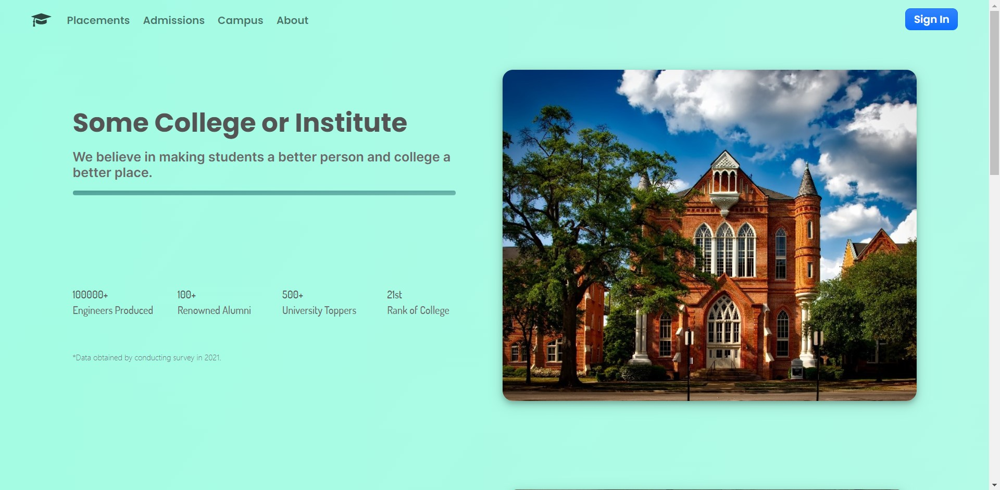

# Django-Website
##### A responsive university website based on django.

## Built with
- [Django](https://www.djangoproject.com/)
- [Django Rest Framework](https://www.django-rest-framework.org/)
- [Bootstrap](https://getbootstrap.com/),
  [HTML](https://developer.mozilla.org/en-US/docs/Web/HTML) and 
  [CSS](https://developer.mozilla.org/en-US/docs/Web/CSS)
- A lot of tea 😂

#### Front Page of the site

